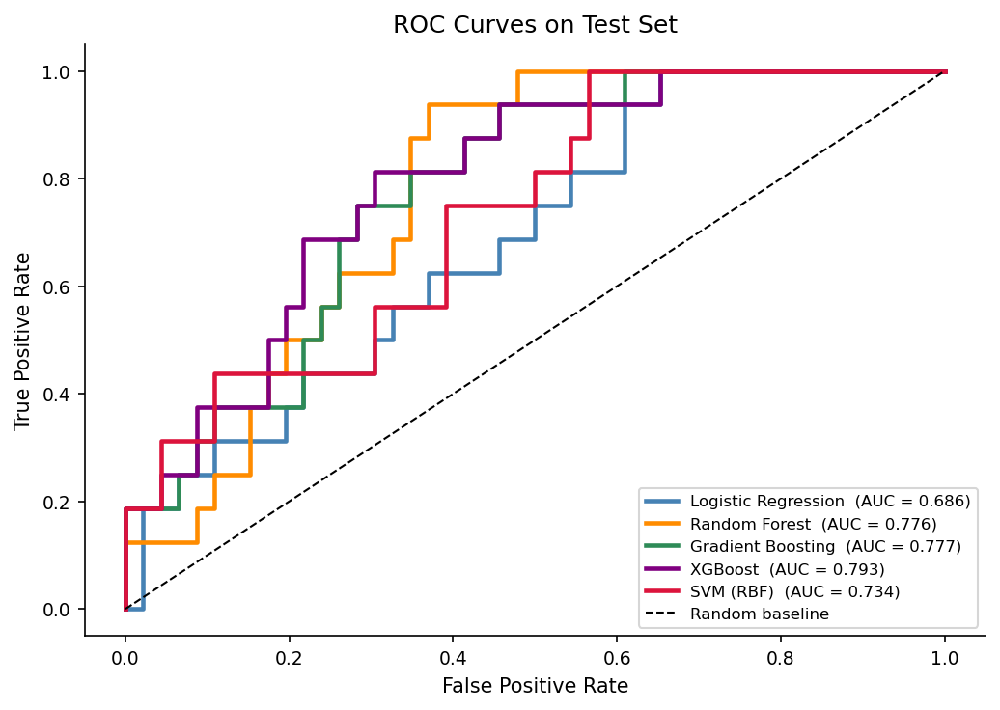
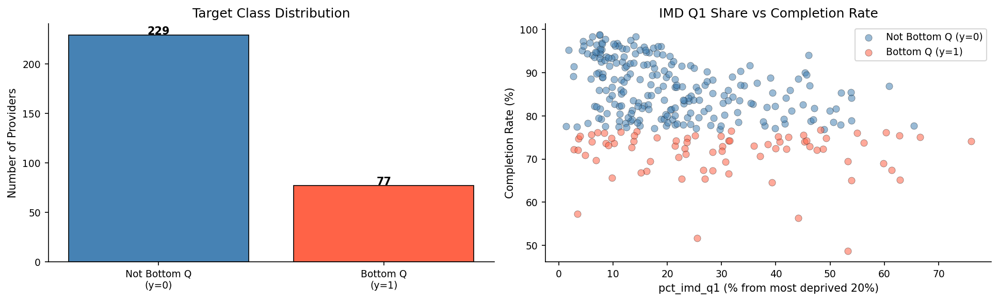
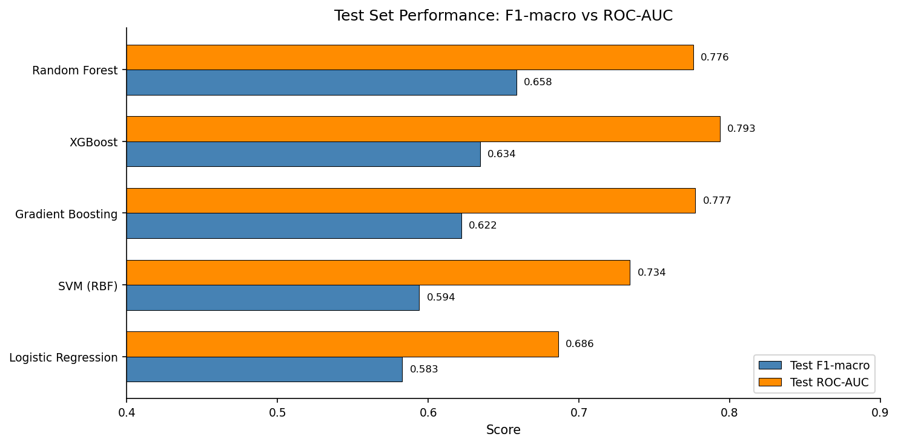
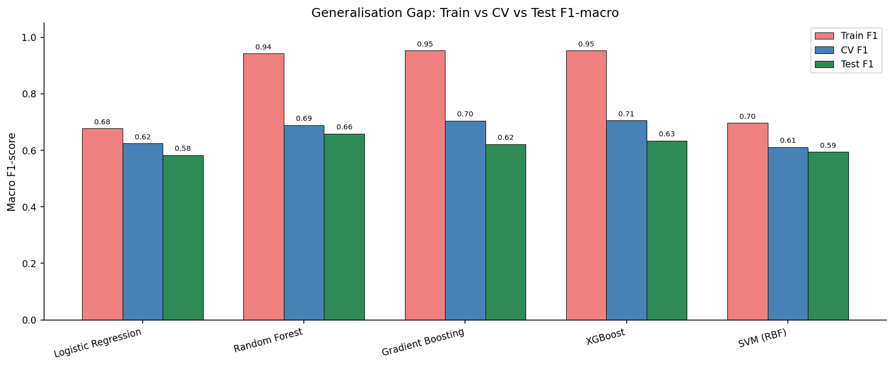
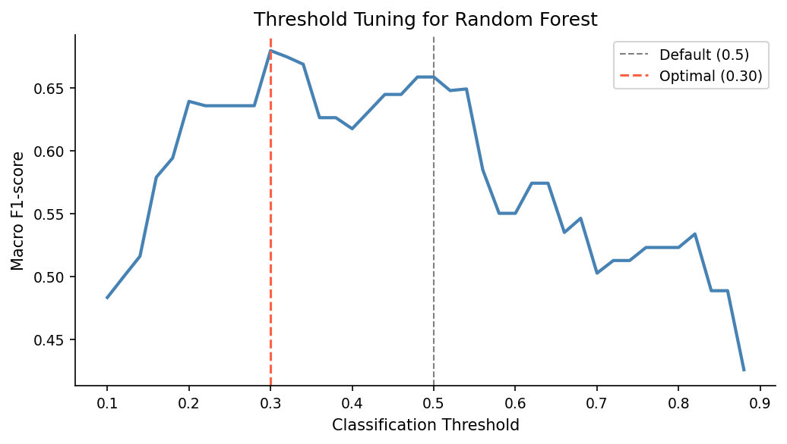
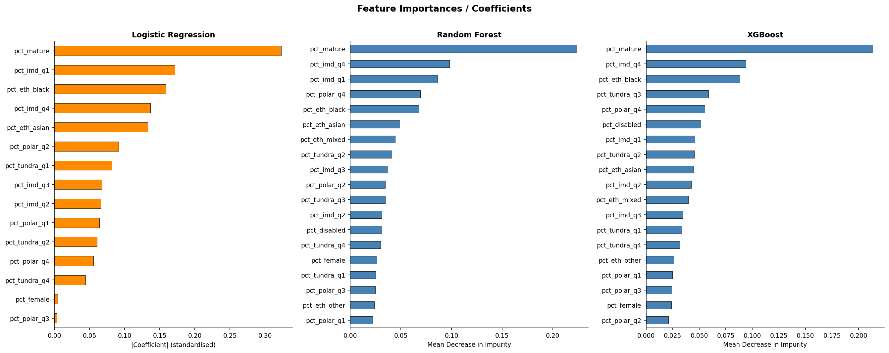
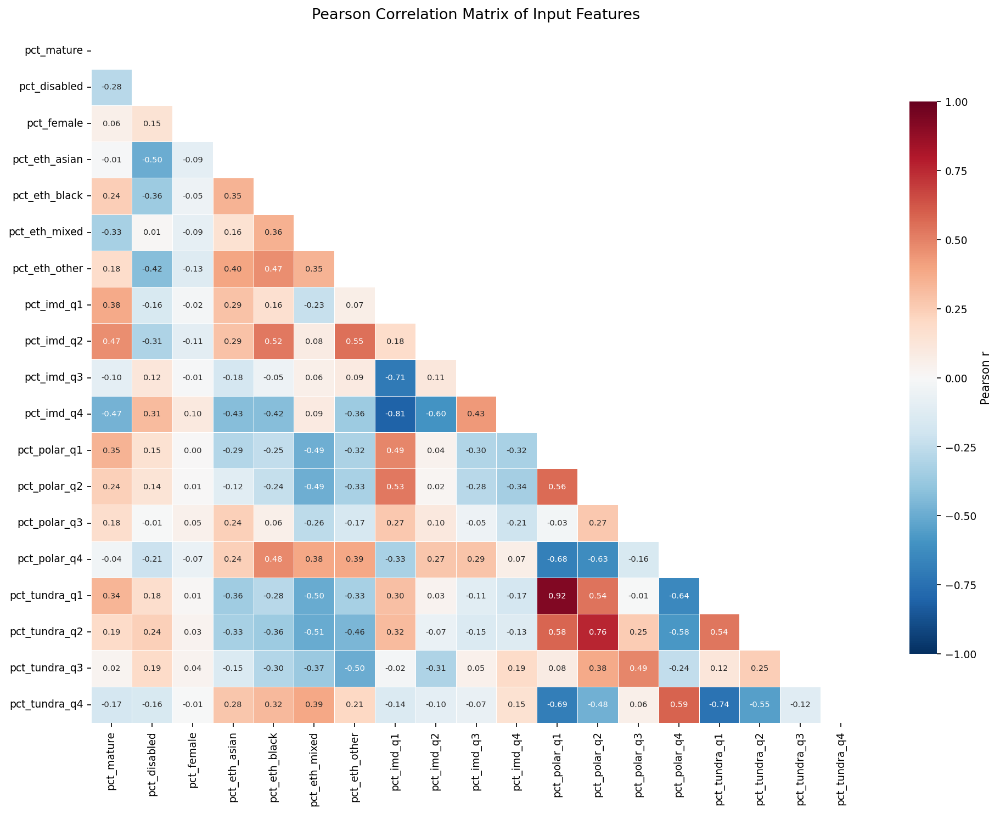
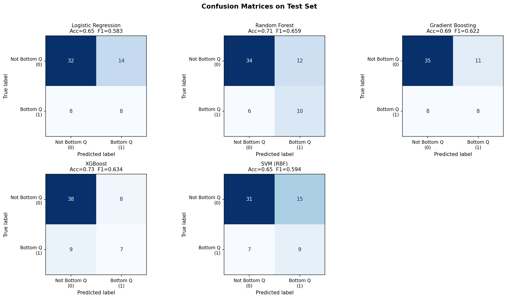
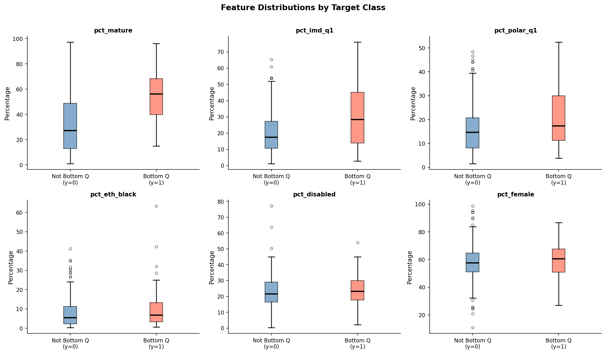
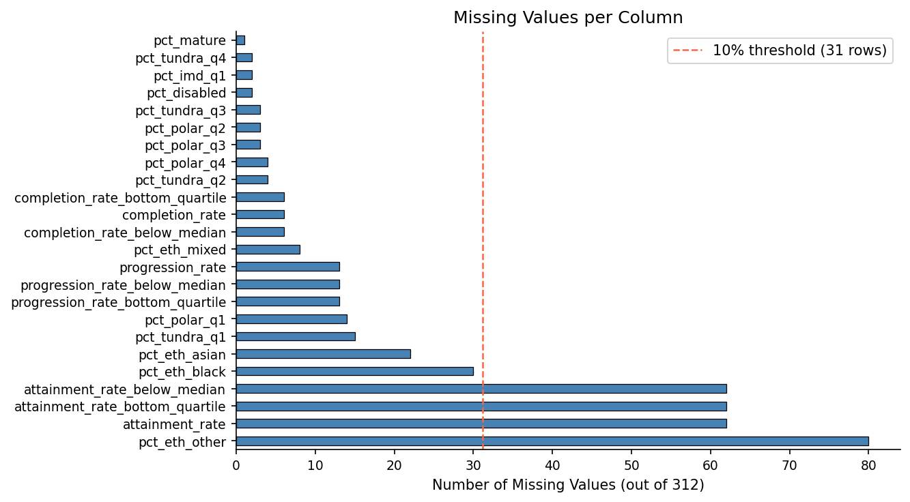

<p align="center">
  
</p>

<h1 align="center">UK Higher Education Completion Risk Classifier</h1>

<p align="center">
  <i>Can a university's student intake demographics predict whether it will fall into the bottom 25% for degree completion?</i>
</p>

<p align="center">
  
  
  
  
</p>

---

## The Problem

The **Office for Students (OfS)** regulates higher education in England. One of its core accountability metrics is *completion rate* — the share of students who finish their programme within the expected timeframe. Providers with persistently low completion face regulatory scrutiny and potential sanctions.

This project asks a pointed question: **is low completion structurally predictable from who attends the institution?** If the answer is yes, then completion gaps are largely baked into intake composition, and the OfS could use demographic profiles as early-warning signals when reviewing Access and Participation Plans.

The dataset covers **312 English HE providers** — research-intensive universities, post-1992 institutions, FE colleges, and specialist providers — with outcome rates rolled up across four reporting years.

---

## The Approach

Binary classification. The continuous completion rate is split at the **25th percentile**: providers below are labelled as at-risk (y=1, n=77), the rest as y=0 (n=229). That 25:75 imbalance is real and shapes every design decision.

<p align="center">
  
</p>

<p align="center"><sub>Left: class balance (3:1 split). Right: providers from deprived areas (high IMD Q1) cluster in the low-completion zone, but the overlap is substantial — no single feature is enough.</sub></p>

### Feature Space

Nineteen continuous percentages describing student composition:

```
Age              pct_mature
Disability       pct_disabled
Sex              pct_female
Ethnicity        pct_eth_asian  pct_eth_black  pct_eth_mixed  pct_eth_other
Deprivation      pct_imd_q1    pct_imd_q2     pct_imd_q3     pct_imd_q4
Participation    pct_polar_q1  pct_polar_q2   pct_polar_q3   pct_polar_q4
                 pct_tundra_q1 pct_tundra_q2  pct_tundra_q3  pct_tundra_q4
```

Reference categories (white ethnicity, IMD/POLAR/TUNDRA Q5) are excluded to avoid multicollinearity.

### Pipeline

Every model follows the same disciplined pipeline to prevent data leakage:

```
Median Imputation (training stats only)
        |
    SMOTE 1:1 (training folds only)
        |
   [StandardScaler]  (LR, SVM only)
        |
   [SelectKBest]     (LR only)
        |
     Classifier
```

Five classifiers, each testing a different inductive bias:

| Model | Why it's here |
|---|---|
| **Logistic Regression** | Interpretable linear baseline; coefficients show per-feature risk |
| **Random Forest** | Captures non-linear interactions; bagging stabilises small-sample variance |
| **Gradient Boosting** | Sequential error correction; typically lowest bias on tabular data |
| **XGBoost** | L1/L2 regularisation on leaf weights; built-in feature selection for collinear inputs |
| **SVM (RBF)** | Kernel-based boundary; sanity check against tree-based models |

Tuning: **5-fold stratified CV** on 244 training samples, scored by **macro F1** (treats both classes equally — accuracy would let a majority-class predictor score 74.8% while catching zero at-risk providers).

---

## Results

### Model Comparison

<p align="center">
  
</p>

| Model | Test Accuracy | Test F1-macro | Test ROC-AUC |
|---|:---:|:---:|:---:|
| **Random Forest** | 0.710 | **0.659** | 0.776 |
| XGBoost | 0.726 | 0.634 | **0.794** |
| Gradient Boosting | 0.694 | 0.622 | 0.777 |
| SVM (RBF) | 0.645 | 0.594 | 0.734 |
| Logistic Regression | 0.645 | 0.583 | 0.686 |

**Random Forest wins on F1** (the metric that matters for balanced class performance). XGBoost leads on AUC but is more conservative — it produces better probability rankings but misses more at-risk providers at the default threshold.

### Generalisation

<p align="center">
  
</p>

Tree-based models hit 94%+ training F1 but drop to ~0.65 on test — the gap is overfitting from only 244 training rows, not a methodology flaw. The CV-to-test gap is under 0.07 for all models, confirming that grid search regularisation is working.

### Threshold Tuning

In the OfS context, **missing a struggling provider is worse than over-flagging one that turns out fine**. A missed provider gets no intervention; a falsely flagged one just gets reviewed.

Lowering the classification threshold from 0.50 to **0.30** pushes minority-class recall from 0.62 to **0.94**: the model catches **15 of 16** bottom-quartile providers in the test set, at the cost of 18 false positives (up from 12).

<p align="center">
  
</p>

### What Drives Completion Risk?

<p align="center">
  
</p>

**`pct_mature` dominates across all three models.** Providers where over half the intake is aged 21+ (median 56.2% for bottom-quartile vs 27.2% for the rest) tend to be FE colleges and specialist providers offering part-time or distance learning. Mature students juggle work, family, and study simultaneously, driving higher structural dropout rates.

IMD deprivation ranks second. Providers with high `pct_imd_q1` (most deprived 20%) face a compounding effect: mature students *from* deprived backgrounds experience a double disadvantage.

| Feature | Bottom Q median | Rest median | Gap |
|---|:---:|:---:|:---:|
| `pct_mature` | 56.2% | 27.2% | +29.0 pp |
| `pct_imd_q1` | 30.2% | 20.7% | +9.5 pp |
| `pct_polar_q1` | 14.5% | 11.8% | +2.7 pp |
| `pct_disabled` | 18.2% | 16.6% | +1.6 pp |

---

## Visualisations

All figures are pre-rendered in `figures/` and reproduced by the notebook. Here is a selection:

<table>
<tr>
<td><br/><sub>Pearson correlation matrix — POLAR and TUNDRA overlap heavily (r=0.92)</sub></td>
<td><br/><sub>Confusion matrices for all five models on the test set</sub></td>
</tr>
<tr>
<td><br/><sub>Boxplots of key features split by target class</sub></td>
<td><br/><sub>Missing-value profile with 10% threshold line</sub></td>
</tr>
</table>

---

## Repository Structure

```
UK-HE-Completion-Risk-Classifier/
|
|-- README.md
|-- LICENSE
|-- requirements.txt
|-- .gitignore
|
|-- data/
|   +-- ofs_provider_outcomes.csv        312 providers, 33 columns
|
|-- notebooks/
|   +-- completion_risk_analysis.ipynb   Full pipeline: EDA -> training -> evaluation
|
+-- figures/
    |-- fig_eda_overview.png
    |-- fig_missing_values.png
    |-- fig_correlation_heatmap.png
    |-- fig_feature_distributions.png
    |-- fig_lr_tuning.png
    |-- fig_rf_tuning.png
    |-- fig_gb_tuning.png
    |-- fig_xgb_tuning.png
    |-- fig_svm_tuning.png
    |-- fig_model_comparison.png
    |-- fig_generalisation_gap.png
    |-- fig_threshold_tuning.png
    |-- fig_confusion_matrices.png
    |-- fig_roc_curves.png
    |-- fig_feature_importances.png
    +-- fig_per_class_metrics.png
```

---

## Reproduce

```bash
git clone https://github.com/DataScienceVishal/UK-HE-Completion-Risk-Classifier.git
cd UK-HE-Completion-Risk-Classifier

python3 -m venv .venv
source .venv/bin/activate
pip install -r requirements.txt

jupyter lab notebooks/completion_risk_analysis.ipynb
```

The notebook reads the CSV via `../data/ofs_provider_outcomes.csv` and writes figures to `../figures/`. It runs top-to-bottom with no manual steps. All random seeds are pinned to 42.

---

## Ethical Note

The feature vector includes proxies for protected characteristics: ethnicity shares, deprivation indices, and mature-student rates. A model that flags institutions with high proportions of students from disadvantaged backgrounds as "at risk" could easily be misread as blaming those institutions. The real story is about **systemic inequalities** affecting their students. Results here are descriptive of structural patterns, not a basis for punishment or withdrawal of funding.

---

## Limitations

- **Sample size is the bottleneck.** 244 training rows with 19 features; tree models have capacity to spare but generalisation suffers.
- **No provider-type variable.** Russell Group, post-1992, and FE colleges have fundamentally different missions and resources, but the dataset treats them identically.
- **The model cannot distinguish student-level from institutional causes.** High `pct_mature` may reflect financial pressure on students, or it may reflect weaker part-time support structures. Disentangling these requires student-level data.
- **Gross enrolment ratios and aggregation across four years smooth out year-to-year dynamics**, including COVID-era disruption.

---

## Data Source

Office for Students (OfS) Access and Participation Data Dashboard.
<https://www.officeforstudents.org.uk/data-and-analysis/access-and-participation-data-dashboard/>

---

## License

Released under the [MIT License](LICENSE).
